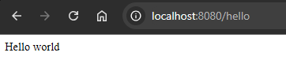

# Hello

This project is a simple Spring Boot application that displays the message "Hello World" in the browser.

## Description

The application is developed with Spring Boot and displays a "Hello World" message in the browser when accessing the `/hello` route. It's a basic example to familiarize yourself with the structure of a Spring Boot project.

<div align="center">
    
</div>

> **Note**: The image above shows how the "Hello World" message will appear when accessing the application from a browser.

## Requirements

- **Java 11** or higher
- **Apache Maven** (to manage dependencies and build the project)
- **Docker** (optional, if you want to run the application in a container)

> **Note:** Make sure that the `JAVA_HOME` and `MAVEN_HOME` environment variables are correctly configured on your system.

## Installation and Execution

1. **Clone the repository** on your local machine:

    ```bash
    git clone https://github.com/Jonablo/hello.git
    cd hello
    ```

2. **Build the project** using Maven:

    ```bash
    mvn clean install
    ```

3. **Start the application** with Spring Boot:

    ```bash
    mvn spring-boot:run
    ```

4. **Verify the execution**: Once the application is running, open a browser and visit `http://localhost:8080/hello`. You should see the "Hello World" message on the screen.

## Running with Docker

This project includes a Dockerfile to run the application in a container.

1. **Build the Docker image**:

    ```bash
    docker build -t jonablo/spring-boot-hello .
    ```

2. **Start a container** with the created image:

    ```bash
    docker run -p 8080:8080 jonablo/spring-boot-hello
    ```

3. **Verify execution in Docker**: Open a browser and go to `http://localhost:8080/hello` to see the "Hello World" message.

## Project Structure

- **src/main/java**: Contains the application's source code.
- **src/main/resources**: Contains the application's configuration files.
- **Dockerfile**: Configuration to create a Docker image of the application.

## Troubleshooting

- **Port Already in Use**: If `8080` is occupied, you can change the port in the `application.properties` file or specify another one when running Docker (`docker run -p <another_port>:8080 jonablo/spring-boot-hello`).

## Contributions

If you would like to contribute, fork the repository and submit a pull request. All contributions are welcome!

## License

This project is under the MIT License.